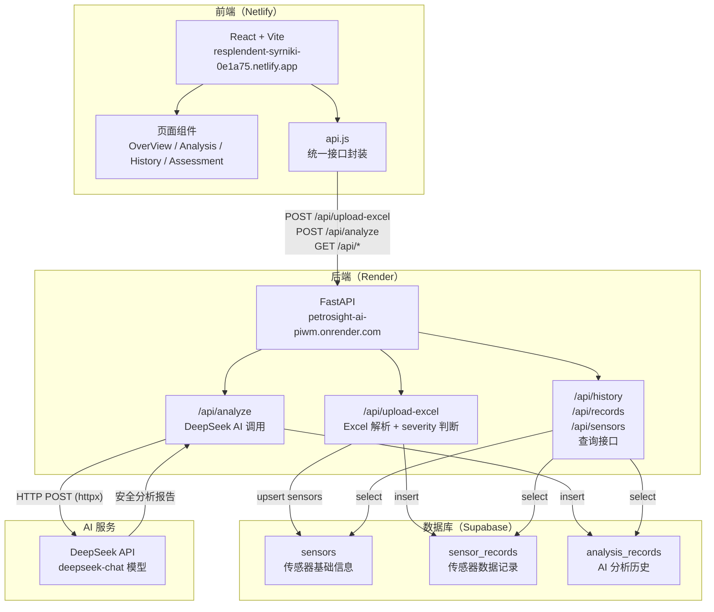

# 系统架构

## 整体架构图



---

## 各层职责说明

### 前端（React + Vite）
- 提供传感器数据的可视化展示界面
- 支持 Excel 文件拖拽上传，触发后端解析流程
- 调用 AI 分析接口并以 Markdown 格式渲染报告
- 路由结构：厂区总览 / 数据分析 / 历史日志 / 状态评估

### 后端（FastAPI）
- 无状态 REST API 服务，所有业务逻辑集中在 `main.py`
- 负责 Excel 文件解析（pandas）、severity 规则判断、数据库读写
- 代理调用 DeepSeek API，屏蔽前端对 AI 密钥的直接访问
- CORS 白名单控制，仅允许指定的 Netlify 域名和本地开发端口

### 数据库（Supabase）
- 托管 PostgreSQL，通过 supabase-py 客户端以 REST 接口访问
- 三张核心表：传感器基础信息、传感器数据记录、AI 分析历史
- RLS 全部关闭，后端使用 service_role key 统一访问

### AI 服务（DeepSeek）
- 使用 `deepseek-chat` 模型
- 后端构造包含数据摘要的 prompt，生成结构化安全分析报告

---

## 数据流说明

### 传感器数据上传流程

```
用户在前端拖拽上传 Excel 文件
    ↓
前端调用 POST /api/upload-excel（multipart/form-data）
    ↓
FastAPI 接收文件，pandas 解析为 DataFrame
    ↓
遍历每行记录，调用 get_severity() 判断告警等级
    ↓
从记录中提取唯一 sensor_id，upsert 到 sensors 表（自动注册未知传感器）
    ↓
批量 insert 到 sensor_records 表
    ↓
返回解析摘要（total / anomaly_count / categories / zones / severity_breakdown）给前端
    ↓
前端展示数据摘要卡片，激活"开始 AI 分析"按钮
```

### AI 分析流程

```
用户填写分析任务描述，点击"开始 AI 分析"
    ↓
前端携带 user_prompt + data_summary 调用 POST /api/analyze
    ↓
FastAPI 构造包含数据摘要和用户提示的 prompt
    ↓
通过 httpx 异步调用 DeepSeek API（超时 90s）
    ↓
接收 AI 返回的 Markdown 格式安全分析报告
    ↓
将报告和元数据 insert 到 analysis_records 表
    ↓
返回 {"report": "..."} 给前端
    ↓
前端逐行解析 Markdown 并渲染分析报告
```
