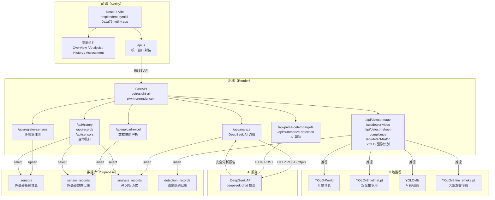

# 系统架构

## 整体架构图



---

## 各层职责说明

### 前端（React + Vite）
- 提供传感器数据的可视化展示界面
- 厂区总览页（OverView）：地图打点、告警信息流、区域/设备弹窗。底图为 HDU 真实卫星图，传感器按 BD09 经纬度定位，详见 [遥感底图与坐标换算](map-coordinates.md)
- 数据分析页（Analysis）：两步式工作流——先注册传感器、再上传数据快照，触发 AI 分析；同时提供图像/视频识别功能（ImageDetectPanel / VideoDetectPanel），支持开放词表、安全帽合规、道路拥堵三种模式
- 历史日志页（History）：查看历史 AI 分析报告
- 状态评估页（Assessment）：传感器数据列表 + 趋势图，支持按区域/等级/类别过滤

### 后端（FastAPI）
- 无状态 REST API 服务，所有业务逻辑集中在 `main.py`
- 数据上传：两步式——先注册传感器（`/api/register-sensors`），再上传数据快照（`/api/upload-excel`）
- AI 分析：从 DB 查回原始传感器数据转 CSV 后直传 DeepSeek，不再只传摘要
- 图像识别：集成 YOLO-World 开放词表 + 多个专用权重（安全帽、火焰烟雾、车辆），支持图片和视频
- CORS 白名单控制，仅允许指定的 Netlify 域名和本地开发端口

### 数据库（Supabase）
- 托管 PostgreSQL，通过 supabase-py 客户端以 REST 接口访问
- 四张核心表：传感器基础信息、传感器数据记录、AI 分析历史、图像识别记录
- RLS 全部关闭，后端使用 service_role key 统一访问

### AI 服务（DeepSeek）
- 使用 `deepseek-chat` 模型，用于：
  1. 传感器安全分析（基于原始 CSV 数据生成结构化报告）
  2. 自然语言解析为检测目标词（`/api/parse-detect-targets`）
  3. 检测结果一句话摘要（`/api/summarize-detection`）

### 图像识别（YOLO）
- YOLO-World（`yolov8s-worldv2.pt`）：开放词表，用户自定义检测目标
- YOLOv8 专用权重：
  - `weights/fire_smoke.pt` / `weights/fire_smoke2.pt`：火焰、烟雾检测
  - `weights/helmet.pt`：安全帽检测（配合通用 person 模型做合规判断）
  - `yolov8s.pt`：通用车辆检测（道路拥堵分析）
  - `yolov8n.pt`：通用 person 检测（安全帽合规中的人员定位）

---

## 数据流说明

### 传感器数据上传流程（两步式）

```
步骤一：注册传感器
用户上传 sensors.xlsx（含 id/type/zone/lng/lat 等）
    ↓
前端调用 POST /api/register-sensors
    ↓
FastAPI upsert 到 sensors 表

步骤二：上传数据快照
用户拖拽上传数据 Excel（同一时刻所有传感器读数）
    ↓
前端调用 POST /api/upload-excel
    ↓
FastAPI 校验 sensor_id 是否已注册 → 批量 insert sensor_records
    ↓
返回解析摘要，前端展示数据卡片，激活"开始 AI 分析"按钮
```

### AI 分析流程

```
用户填写分析任务描述，点击"开始 AI 分析"
    ↓
前端携带 user_prompt + data_summary 调用 POST /api/analyze
    ↓
FastAPI 从 sensor_records 查回原始记录，转为 CSV 字符串
    ↓
将 CSV 原始数据嵌入 prompt，调用 DeepSeek API（超时 90s）
    ↓
接收 AI 返回的 Markdown 格式安全分析报告
    ↓
将报告和元数据 insert 到 analysis_records（data_summary 只存简要统计）
    ↓
返回 {"report": "..."} 给前端渲染
```

### 图像识别流程

```
用户输入自然语言描述（可选）
    ↓
前端调用 POST /api/parse-detect-targets → 获取 task + classes
    ↓
用户上传图片/视频，选择模型和参数
    ↓
前端调用对应检测接口（detect-image / detect-video / detect-helmet-compliance / detect-traffic）
    ↓
后端加载 YOLO 模型（懒加载，首次耗时约 2-5s）→ 推理 → 返回归一化检测框
    ↓
检测结果异步落库到 detection_records
    ↓
前端在图片/视频上叠加绘制检测框
    ↓
（可选）调用 POST /api/summarize-detection 生成一句话 AI 摘要
```
